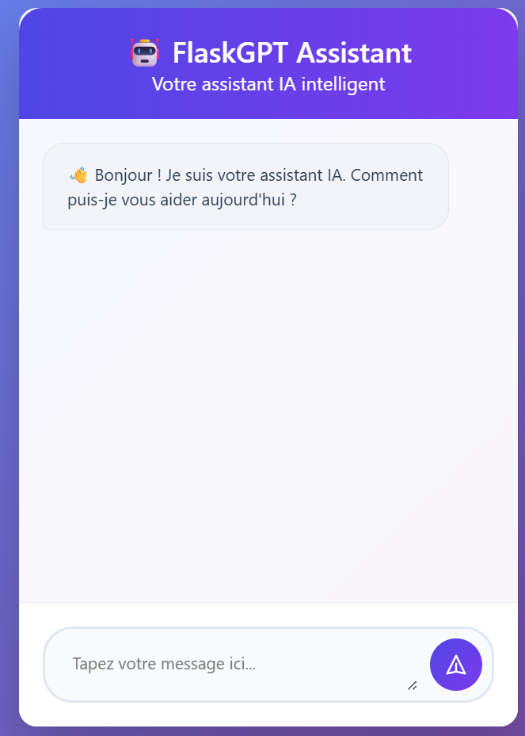

# FlaskGPT




## English

### Description
FlaskGPT is a simple web application built with Flask that integrates OpenAI's API. It serves as a starting point for building AI-powered web apps.

### Features
- Flask web server
- Integration with OpenAI API
- Environment variable management with dotenv

### Installation

1. **Clone the repository:**
   ```bash
   git clone https://github.com/Thrylos77/flask_chat_AI.git
   cd flask_chat_AI
   ```

2. **Install Python dependencies:**
   ```bash
   pip install -r requirements.txt
   ```
   Or, if you use Poetry:
   ```bash
	poetry init
	poetry add flask==2.3.3
	poetry add openai==0.27.10
	poertry add python-dotenv==1.0.0
   ```

3. **Install Node.js dependencies (for static assets, if needed):**
   ```bash
   npm install
   ```

### Configuration

- Create a `.env` file at the root of the project and add your OpenAI API key:
  ```
  OPENAI_API_KEY=your_openai_api_key_here
  ```

## Français

### Description
FlaskGPT est une application web simple construite avec Flask qui intègre l’API d’OpenAI. Elle sert de point de départ pour créer des applications web alimentées par l’IA.

### Fonctionnalités
- Serveur web Flask
- Intégration de l’API OpenAI
- Gestion des variables d’environnement avec dotenv

### Installation

1. **Clonez le dépôt :**
   ```bash
   git clone https://github.com/Thrylos77/flask_chat_AI.git
   cd flask_chat_AI
   ```

2. **Installez les dépendances Python :**
   ```bash
   pip install -r requirements.txt
   ```
   Ou, si vous utilisez Poetry :
   ```bash
   	poetry init
	poetry add flask==2.3.3
	poetry add openai==0.27.10
	poertry add python-dotenv==1.0.0
   ```

3. **Installez les dépendances Node.js (pour les assets statiques, si besoin) :**
   ```bash
   npm install
   ```

### Configuration

- Créez un fichier `.env` à la racine du projet et ajoutez votre clé API OpenAI :
  ```
  OPENAI_API_KEY=votre_clé_openai_ici
  ```